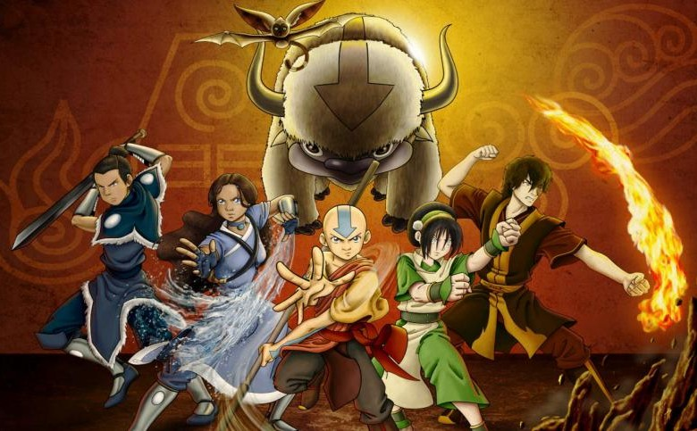

# 🔷 Código Enigma 🔷
## 📚 Integrantes:
- Aguirre Cerullo, Rocío Belén
- Colombo, Agustín
- Dicalbo, Juan Cruz
- Dominguez, Eliana
- Elias, Francisco
- Ramos, Dilan
- Rojas, Arón

**Práctica de Juego "Avatar: La Leyenda de Aang**! 🎓  

==============================================================================
Ejercitación realizada:
1. Ingresamos al subsistema Linux dentro de Windows
2. Vamos al directorio **/Practicas** con el comando: ```cd Practicas```, en caso que no exista, crearlo con el comando ```mkdir /Practicas```
3. Ingresamos en el directorio /Practicas, y revisamos si existe el directorio **/Avatar** con el comando: ```ls```, caso contrario, crear el directorio con ```mkdir```
4. Dentro del directorio /Avatar, creamos los directorios **/public**, **/assets**, **/css** y **/js**.
5. Con ````touch``` crearemos el archivo **Readme.md**
6. Con el mismo comando, crearemos el archivo **avatar.html**
7. Abriremos Visual Studio Code colocando solo un punto '.'
8. Cargamos el html5 por default que ofrece **VSC**
9. Recordar que los comentarios se ingresan con ```<!---->```
==============================================================================

